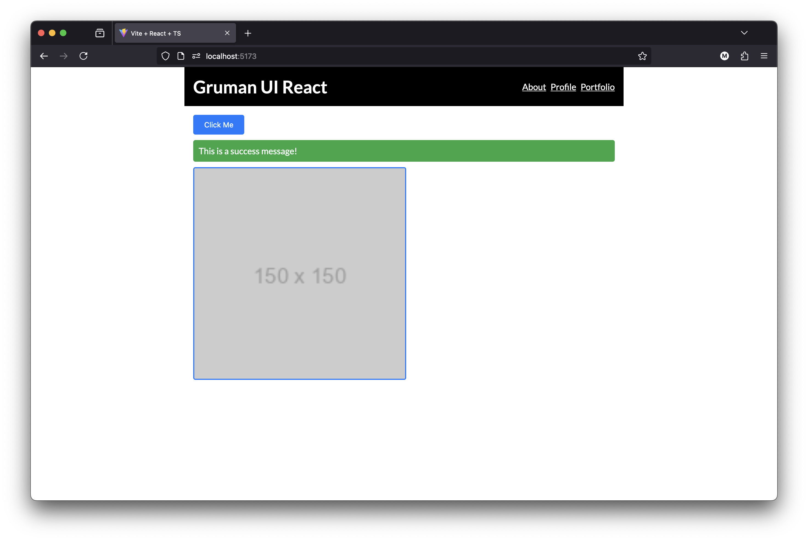

# Gruman UI React



A lightweight React component library providing customizable UI components with universal theming support, including Buttons, Alerts, Images, and Containers for rapid development. Visit [NPM](https://www.npmjs.com/package/gruman-ui-react) for more info.

## Install

```bash
yarn add gruman-ui-react styled-components @types/node

or

npm install gruman-ui-react styled-components @types/node
```

## Usage

```bash
import React, { useState } from 'react';
import { Button, Alert, Image, Container, ThemeProvider, Header, Input } from './gruman-ui-react';
import './gruman-ui-react/dist/styles.css';

const menu = [
  {
    title: "About",
    link: "https://gruman.co/about"
  },
  {
    title: "Profile",
    link: "https://gruman.co/profile"
  },
  {
    title: "Portfolio",
    link: "https://gruman.co/porfolio"
  }
]

const home = {
  title: "Gruman UI React",
  link: "/"
}

const App: React.FC = () => {

  const [inputValue, setInputValue] = useState<string>("");
  const [textareaValue, setTextareaValue] = useState<string>("");

  return (
    <ThemeProvider>
      <Container>
        <Header menu={menu} home={home} />
        <main>
          <h1>Heading 1</h1>
          <h2>Heading 2</h2>
          <h3>Heading 3</h3>
          <h4>Heading 4</h4>
          <h5>Heading 5</h5>
          <p>Paragraph</p>
          <ul>
            <li>Unordered</li>
            <li>List</li>
          </ul>
          <ol>
            <li>Ordered</li>
            <li>List</li>
          </ol>
          <Button title="Click Me" onClick={() => alert('Clicked!')} />
          <Alert message="This is an Alert" type="success" />
          <h2>Images</h2>
          <h3>100%</h3>
          <Image
            src="https://placehold.co/600x400"
            alt="100%"
            width="100%"
            type=""
          />

          <h3>50%</h3>
          <Image
            src="https://placehold.co/600x400"
            alt="50%"
            width="50%"
            type=""
          />

          <h3>Polaroid</h3>
          <Image
            src="https://placecats.com/neo/300/300"
            alt="25% Polaroid"
            width="25%"
            type="polaroid"
          />

          <Image
            src="https://placecats.com/300/300"
            alt="50% Polaroid"
            width="50%"
            type="polaroid"
          />
          <h2>Forms</h2>
          <Input type="text" value={inputValue} placeholder="Enter text" onChange={e => setInputValue(e)} />
          <Input type="textarea" value={textareaValue} placeholder="Enter textarea" onChange={e => setTextareaValue(e)} />
        </main>
      </Container>
    </ThemeProvider>
  );
};

export default App;

```